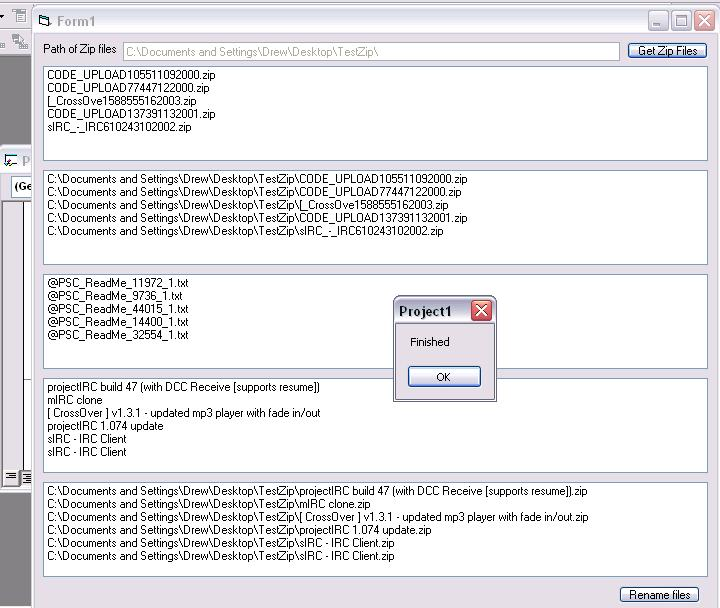



## PScode file renamer See new version

### Description

Trys to rename zip file to their submission name.

eg. CODE_UPLOAD105511092000.zip TOO

projectIRC build 47.zip

Bugs: There are many

*Sometimes adds last zip file twice

*Cannot rename files with certain charaters eg _

*Errors when there are more then 1 txt file in the zip

*Relys on the timer for zip operations 5sec works for my computer may need slower for slower machines.

Maybe others

Instructions:

* Make a copy of a few zip files from pscode and put in a folder

* Point the text box to ur directory (must end with "\"

* Click "Get Zipfiles"

* Wait until finished

* Click "rename files"

Needs:

MS scripting

Winzip

Plz help this project it is so you don't have to go through each one and rename.

----

Updated: All bugs fixed except for when there are multiple txt files in the zip.

Plz if you have any suggestion on how to only get the txt files that start with "@" plz submit feedback or email me.

Thankyou to Roger Gilchrist for his RStrip and LStrip functions :)

New version at:

http://www.pscode.com/vb/scripts/ShowCode.asp?txtCodeId=49691&lngWId=1
 
### More Info
 
See Description

See Bugs

             |
---                |---
**Submitted On**   |2003-11-05 19:03:02
**By**             |[Shazbot](https://github.com/Planet-Source-Code/PSCIndex/blob/master/ByAuthor/shazbot.md)
**Level**          |Beginner
**User Rating**    |4.5 (27 globes from 6 users)
**Compatibility**  |VB 6\.0
**Category**       |[Files/ File Controls/ Input/ Output](https://github.com/Planet-Source-Code/PSCIndex/blob/master/ByCategory/files-file-controls-input-output__1-3.md)
**World**          |[Visual Basic](https://github.com/Planet-Source-Code/PSCIndex/blob/master/ByWorld/visual-basic.md)
**Archive File**   |[PScode\_fil1668141152003\.zip](https://github.com/Planet-Source-Code/shazbot-pscode-file-renamer-see-new-version__1-49672/archive/master.zip)

